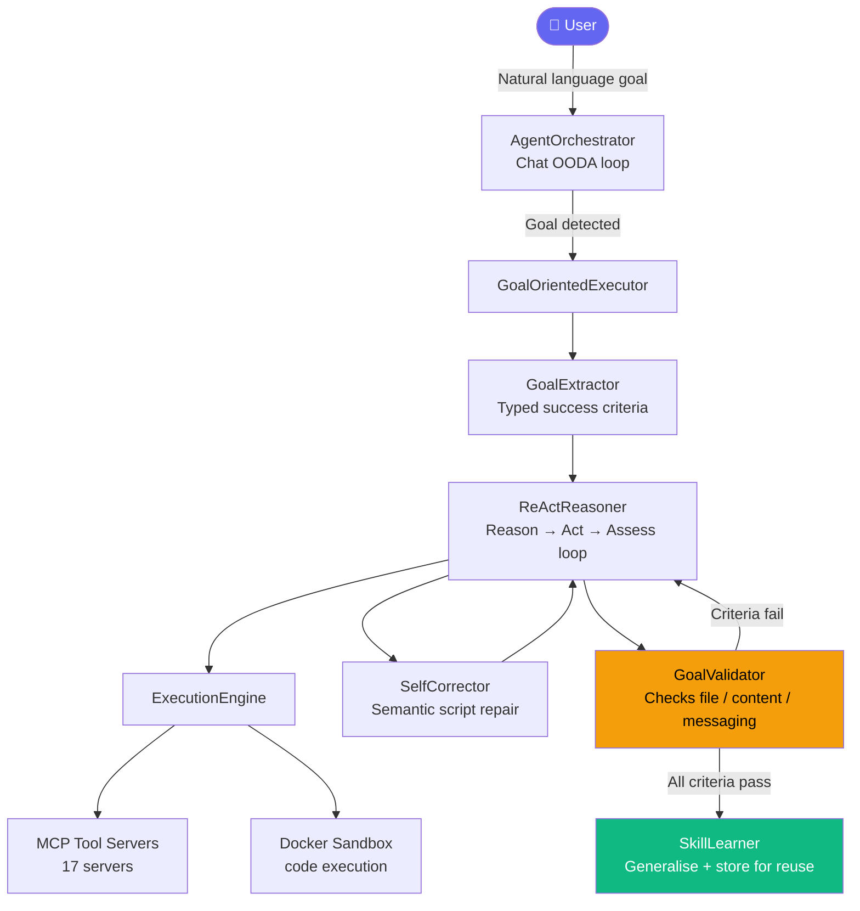

<div align="center">

<h1>🤖 AI Partner</h1>

<p><strong>Autonomous multi-agent orchestration platform that executes complex goals end-to-end — without hand-holding.</strong></p>

<p>Give it a goal in plain English. It researches, writes code, generates documents, and delivers results to your Telegram, Discord, or Slack — autonomously.</p>

[](LICENSE)
[](https://github.com/AmitkrPaiwal/AI-Partner/stargazers)
[](https://github.com/AmitkrPaiwal/AI-Partner/network/members)
[](https://github.com/AmitkrPaiwal/AI-Partner/commits/main)
[](https://github.com/AmitkrPaiwal/AI-Partner/issues)
[](docker-compose.yml)
[](https://www.typescriptlang.org/)
[](server/src/tests)

---

[**⚡ Quick Start**](#-quick-start) · [**✨ Features**](#-features) · [**🤖 Agent Profiles**](#-agent-profiles) · [**🔌 Integrations**](#-integrations) · [**📐 Architecture**](#-architecture) · [**🗺️ Ecosystem**](#-ecosystem-landscape)

</div>

---

## 🎬 See It In Action

<table>
  <tr>
    <td align="center" width="50%">
      <a href="https://youtu.be/Yyi0TMZM-90" target="_blank">
        
      </a><br/>
      <sub><b>▶ Goal → autonomous execution</b></sub>
    </td>
    <td align="center" width="50%">
      <a href="https://youtu.be/igkmf_TJabo" target="_blank">
        
      </a><br/>
      <sub><b>▶ Browser automation & delivery</b></sub>
    </td>
  </tr>
</table>


---

## 🎯 What Is AI Partner?

AI Partner is a **self-hosted, autonomous AI agent platform** you run on your own machine with Docker. You describe a goal — it decomposes it into tasks, executes them using real tools (web search, code execution, file generation, messaging), validates outcomes against measurable criteria, and delivers results to you automatically.

```
"Research the top 10 AI tools launched this week,
 write a PDF comparison report, and send it to my Telegram."
```

AI Partner will: search the web → extract data → analyse results → generate a PDF → send to Telegram → confirm delivery. **You don't touch it again.**

---

## ⚡ Quick Start

> **Requirements:** [Docker Desktop](https://www.docker.com/products/docker-desktop/) + one LLM API key (OpenAI, Anthropic, Gemini, Groq, DeepSeek, or local Ollama)

**Mac / Linux — one command:**
```bash
curl -fsSL https://raw.githubusercontent.com/AmitkrPaiwal/AI-Partner/main/setup.sh | bash
```

**Windows — paste into PowerShell:**
```powershell
iwr -useb https://raw.githubusercontent.com/AmitkrPaiwal/AI-Partner/main/install.ps1 | iex
```

**Or manually:**
```bash
git clone https://github.com/AmitkrPaiwal/AI-Partner
cd AI-Partner
./setup.sh          # Mac/Linux
.\install.ps1       # Windows (PowerShell)
```

The installer walks you through choosing an LLM provider, entering your API key, and opens the browser UI automatically. **First run takes 2–4 minutes** (Docker image build).

---

## ✨ Features

### 🧠 Autonomous Goal Execution
Type a goal — AI Partner decomposes it, builds an execution plan, runs it with real tools, validates outcomes against measurable success criteria, and **retries or replans on failure**.

- ✅ Up to **3 concurrent goals**, each with up to **5 parallel sub-agents**
- ✅ ReAct loop: Reason → Act → Assess → Retry
- ✅ Self-correcting: if a script errors, it semantically repairs and re-runs
- ✅ Typed success criteria — agent **proves** completion, doesn't just say "done"

### 🤖 16 Specialist Agent Profiles
Pre-built agents with enforced tool whitelists, iteration caps, and automatic routing based on keywords.

| Cluster | Agents |
|---------|--------|
| Research | Web Researcher, Fact Checker, Trend Spotter |
| Dev | Python Developer, Node.js Developer, Debugger, Shell Operator |
| Data | Financial Analyst, Data Analyst, Excel Builder |
| Content | Report Generator, Summarizer, Tech Writer, Prompt Architect, Task Planner |
| Delivery | Telegram Reporter |

Invoke directly: `@fin-analyst what is RELIANCE.NS today?`
Or let keywords auto-route: typing "trending AI tools" fires `@trend-spotter` automatically.

### 🌐 Live Browser Automation
Puppeteer-powered browser with **live CDP screencasting** visible in the UI. When a CAPTCHA appears, the agent pauses and shows a **"Solve CAPTCHA — Take Control"** button. You solve it, the agent resumes.

### 📬 Goal-Integrated Messaging Delivery
Results aren't just saved — they're **validated delivery goals**. The agent marks a task failed if `messaging_send_file` doesn't succeed.

Supports: **Telegram · Discord · Slack · WhatsApp · Signal**

### 🧠 Persistent Memory
- **Episodic memory** — timestamped event log of every conversation and outcome
- **Vector search** — semantic similarity across 4 embedding backends
- **Persona** — biographic facts and preferences injected into every prompt
- **Knowledge base** — upload PDFs/docs for RAG retrieval

### 📄 Document Generation
PDF · Excel (xlsx) · PowerPoint (pptx) · Word (docx) · HTML — downloadable from the UI or sent via messaging.

### 📚 Skill Learning
After a successful goal, AI Partner generalises the solution into a **reusable parameterised skill template**. Deduplicated by embedding similarity. Skills can be promoted to first-class MCP tools.

### ⏰ Scheduler + Triggers
Cron-expression scheduling, webhook triggers, **Google Calendar events**, **Gmail arrival** — all fire autonomous goal execution.

---

## 🤖 Agent Profiles

Each profile specifies:

| Field | Description |
|-------|-------------|
| **Tool whitelist** | Enforced — agent cannot use tools outside its list |
| **Iteration cap** | Prevents runaway loops |
| **Auto-select keywords** | Fires automatically when matched in chat |
| **agentType** | Determines exhaustion behaviour (`research / execution / delivery / synthesis`) |
| **Handoff instructions** | Baked into every system prompt |

Profiles are editable from the UI (**Settings → Agent Profiles**) or by editing `server/src/agents/seedProfiles.ts`.

---

## 🔌 Integrations

Add any key to `.env` — the agent automatically gains those tools.

| Service | Env Var | Tools Unlocked |
|---------|---------|----------------|
| GitHub | `GITHUB_TOKEN` | search repos, list issues, create issues, get files, list PRs, add comments, search code |
| Notion | `NOTION_API_KEY` | search, read page, create page, query database, append blocks |
| Gmail | `GMAIL_USER` + `GMAIL_APP_PASSWORD` | send, search, read, list inbox |
| Google Calendar | `GOOGLE_CALENDAR_ACCESS_TOKEN` | list events, create event, check availability, delete event |
| Google Drive | `GOOGLE_DRIVE_ACCESS_TOKEN` | search, get file, list folder, create file |
| Twitter/X | `TWITTER_BEARER_TOKEN` | search tweets, read timeline (+ OAuth keys for posting) |
| Trello | `TRELLO_API_KEY` + `TRELLO_TOKEN` | list boards/cards, create card, move card, add comment |
| Spotify | `SPOTIFY_ACCESS_TOKEN` | search, play, pause, skip, queue, create playlist |
| Apify | `APIFY_API_TOKEN` | residential proxy scraping for CAPTCHA-protected sites |
| Image Gen | `OPENAI_API_KEY` or `STABILITY_API_KEY` | DALL-E 3 / Stability AI image generation |

**Messaging platforms:** Telegram · Discord · Slack · WhatsApp · Signal

---

## 🧠 LLM Providers

At least one required. Add the key to `.env`:

| Provider | Env Var | Notes |
|----------|---------|-------|
| Anthropic | `ANTHROPIC_API_KEY` | Claude 3.5 / 4 family |
| OpenAI | `OPENAI_API_KEY` | GPT-4o, GPT-4o-mini |
| Google | `GOOGLE_API_KEY` | Gemini 2.0 Flash |
| Groq | `GROQ_API_KEY` | Free tier, very fast (Llama, Mistral) |
| DeepSeek | `DEEPSEEK_API_KEY` | Low cost, strong at coding |
| Mistral | `MISTRAL_API_KEY` | European-hosted option |
| Together AI | `TOGETHER_API_KEY` | Wide open-source model selection |
| Ollama | `OLLAMA_HOST` | Local models, no API key needed |
| Perplexity | `PERPLEXITY_API_KEY` | Search-grounded LLM with citations |

Switch models any time from **Settings → Models** in the UI.

---

## 📐 Architecture



**Concurrency:** Up to 3 concurrent goals, each with up to 5 parallel sub-agents via `delegate_parallel`.

**MCP Tool Servers (17):** web_search · browser_automation · code_executor · file_system · gmail · google_calendar · google_drive · github · notion · twitter · trello · spotify · apify · messaging (Telegram/Discord/Slack/WhatsApp/Signal) · image_generator · document_builder · memory

---

## 🗺️ Ecosystem Landscape

The open-source self-hosted agent space has several strong projects, each built around a different design philosophy. Here's how they are positioned:

| Project | Primary Design Focus | Best Suited For |
|---------|---------------------|-----------------|
| **AI Partner** | End-to-end goal execution with validated outcomes, specialist agents, document generation, and messaging delivery | Users who want to hand off a complete goal and receive a finished, delivered result — with no babysitting |
| **Agent Zero** | OS-level autonomy with dynamic tool creation at runtime; runs in an isolated Docker terminal | Power users who want an agent that can build its own tools and interact deeply with the operating system |
| **OpenClaw** | Personal, always-on AI assistant with a modular skills system; strong messaging integrations | Users who want a self-hosted personal assistant accessible via Telegram, WhatsApp, or iMessage |
| **OpenHands** | Enterprise-grade autonomous software engineering; multi-agent collaboration and audit trails | Engineering teams automating code review, bug fixing, or large-scale software development workflows |
| **OpenManus** | Open alternative to Manus; flexible task decomposition and planning with reinforcement learning | Researchers and developers experimenting with agent reasoning and RL-based decision-making |

> **Where AI Partner fits:** It is the only project in this space that treats goal *delivery* — not just task execution — as a first-class requirement. The agent must prove outcomes via typed success criteria, validates messaging delivery, and self-corrects on failure. The one-command Docker install also makes it the most accessible entry point for non-developer users.

---

## ⚙️ Configuration

Key files — editable without redeploying:

| File | Purpose |
|------|---------|
| `server/prompts/agent.system.md` | Agent core identity |
| `server/prompts/profiles/` | Per-profile LLM prompts |
| `server/prompts/reasoner-reason.md` | ReAct reasoning prompt |
| `server/prompts/reasoner-decide.md` | ReAct action-selection prompt |
| `server/config/blocked-domains.json` | Domains blocked from browser navigation |
| `server/config/data-api-hints.json` | API fallback hints injected when search fails |
| `server/templates/workspace/HEARTBEAT.md` | Proactive agenda tasks |
| `server/templates/workspace/SOUL.md` | Agent persona + quiet hours |

**Environment variables** — see [`.env.example`](.env.example) for the full annotated list.

---

## 🐳 Docker Commands

```bash
# Start
docker compose up -d

# View logs
docker compose logs -f app

# Stop
docker compose down

# Update to latest
./setup.sh --update        # Mac/Linux
.\install.ps1 -Update      # Windows

# Wipe all data and start fresh
./setup.sh --reset
.\install.ps1 -Reset
```

---

## 🛠️ Development

```bash
# Hot-reload dev mode
docker compose -f docker-compose.dev.yml up

# Run unit tests (145 tests)
cd server && npm run test:unit

# TypeScript check
cd server && npx tsc --noEmit
```

---

## 🤝 Contributing

Contributions are welcome! Here are some good places to start:

- Browse [**good first issues**](https://github.com/AmitkrPaiwal/AI-Partner/issues?q=is%3Aissue+is%3Aopen+label%3A%22good+first+issue%22) — beginner-friendly tasks
- [**Open a Discussion**](https://github.com/AmitkrPaiwal/AI-Partner/discussions) to propose features or ask questions
- Submit a PR — all improvements are reviewed within 48 hours

**Ideas for new contributors:**
- New MCP tool server integrations (Linear, Jira, Confluence, Airtable)
- Additional LLM provider adapters
- Browser automation improvements
- UI/UX enhancements
- Documentation and tutorials

---

## 📄 License

[MIT](LICENSE) — free to use, modify, and distribute.

---

<div align="center">

**Built with** TypeScript · Express · React · Puppeteer · Docker · SQLite · MCP

---

⭐ **If AI Partner saves you time, please star this repo** — it helps others find it.

[Star ⭐](https://github.com/AmitkrPaiwal/AI-Partner/stargazers) · [Fork 🍴](https://github.com/AmitkrPaiwal/AI-Partner/network/members) · [Issues 🐛](https://github.com/AmitkrPaiwal/AI-Partner/issues) · [Discussions 💬](https://github.com/AmitkrPaiwal/AI-Partner/discussions)

</div>
